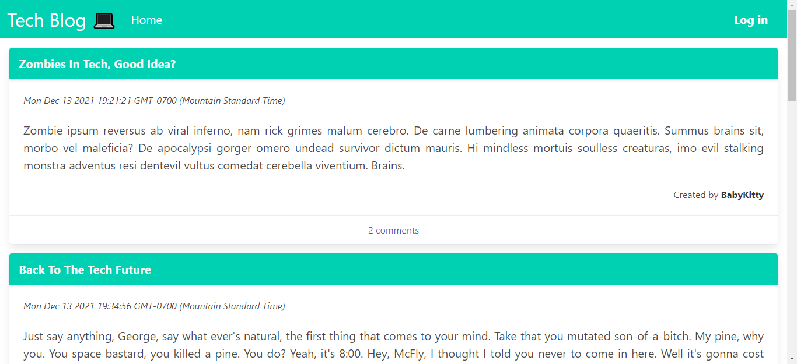
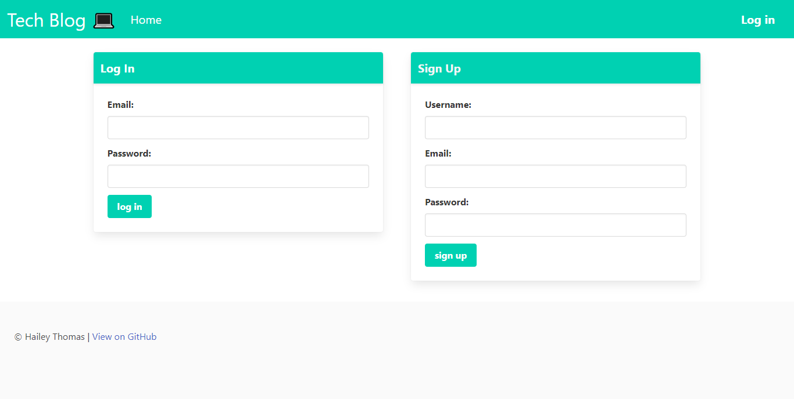
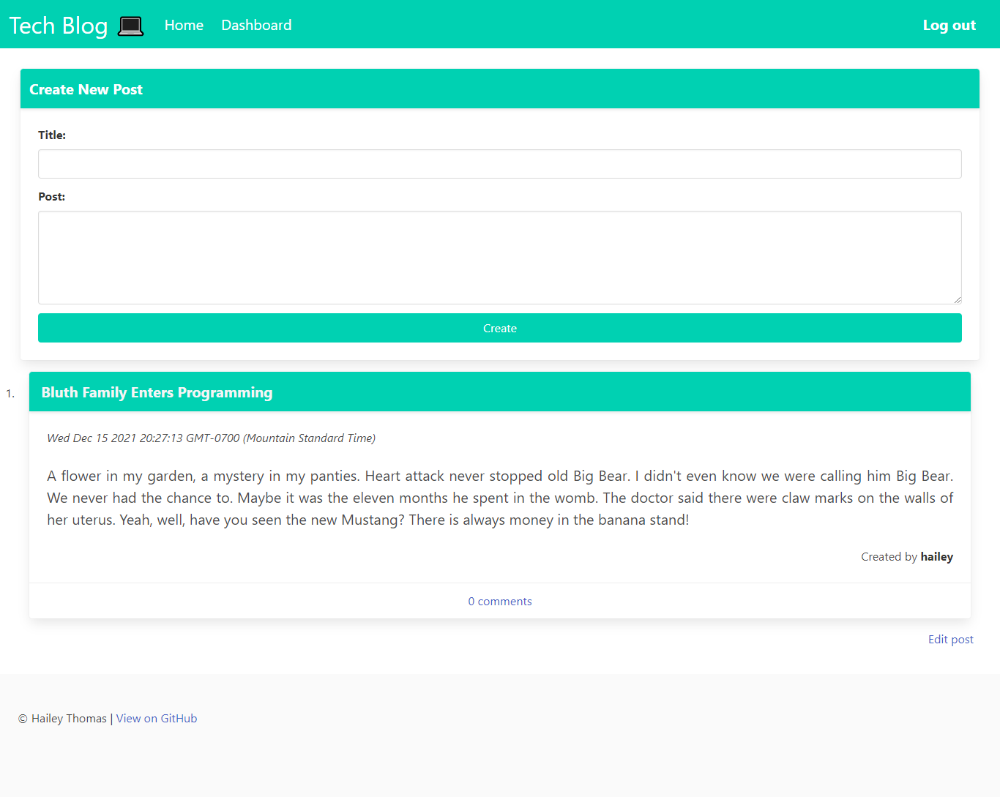
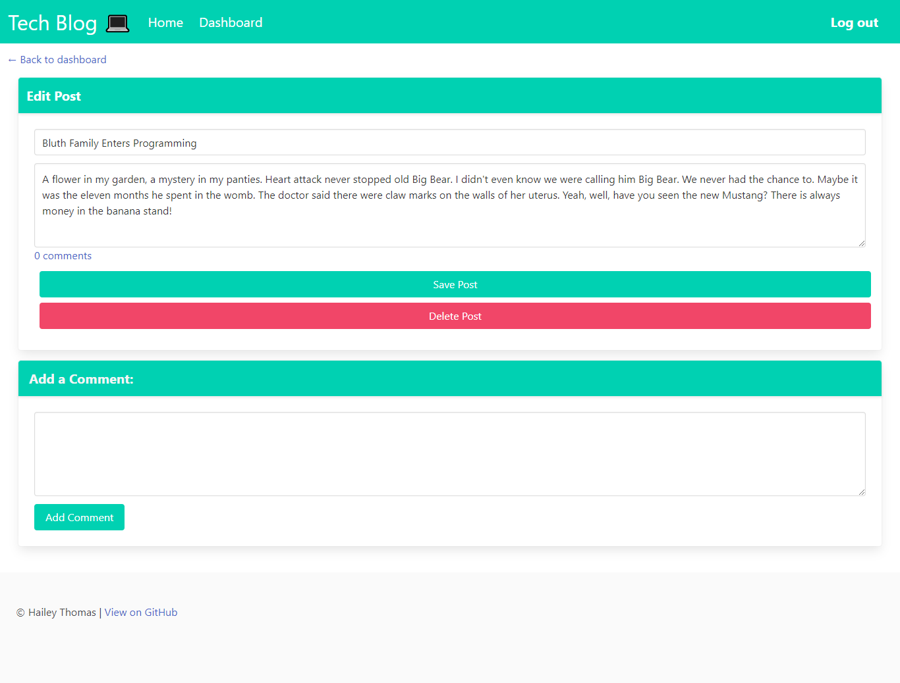

# Tech Blog 💻

## Description

- Tech Blog is a web application where users can post about technology thoughts, news and insights. Users are able to create a profile, login and create posts. They are also able to comment on other users posts and edit or delete their own posts. When they are finished they are able to log out and end their session.

## Table of Contents

* [Usage](#usage)
* [Credits](#credits)
* [License](#license)

## Usage

Load the web application in your browser and you will be presented with a Technology blog with various posts. When you click the login button on the navigation bar, you are directed to a login and sign up page. Here you can either login or sign up and after doing so you are taken to a user dashboard where you can create a new post as well as view your previous posts after they are created. After you are logged in you can now comment on posts. If you click the edit post link on your dashboard you are taken to a page where you can edit or delete your post. After you log out, your session is ended.

### Screenshot

- 

- 

- 

- 

### Links

* [Heroku](https://shrouded-anchorage-40186.herokuapp.com/) - link to deployed web application
* [GitHubPages](https://haileythomas.github.io/tech-blog/) - link to GitHub pages
* [GitHub](https://github.com/HaileyThomas/tech-blog) - link to GitHub project repository

## Credits

Used the following technologies: Bulma framework, MySql, MySql2, Express.js, Node.js, Sequelize, Express- Handlebars, dotenv, bcrypt, Express-Session, connect-session-sequelize

## License

[License](https://opensource.org/licenses/MIT) - link to license

MIT License

Copyright (c) [2021] [Hailey Thomas]

Permission is hereby granted, free of charge, to any person obtaining a copy
of this software and associated documentation files (the "Software"), to deal
in the Software without restriction, including without limitation the rights
to use, copy, modify, merge, publish, distribute, sublicense, and/or sell
copies of the Software, and to permit persons to whom the Software is
furnished to do so, subject to the following conditions:

The above copyright notice and this permission notice shall be included in all
copies or substantial portions of the Software.

THE SOFTWARE IS PROVIDED "AS IS", WITHOUT WARRANTY OF ANY KIND, EXPRESS OR
IMPLIED, INCLUDING BUT NOT LIMITED TO THE WARRANTIES OF MERCHANTABILITY,
FITNESS FOR A PARTICULAR PURPOSE AND NONINFRINGEMENT. IN NO EVENT SHALL THE
AUTHORS OR COPYRIGHT HOLDERS BE LIABLE FOR ANY CLAIM, DAMAGES OR OTHER
LIABILITY, WHETHER IN AN ACTION OF CONTRACT, TORT OR OTHERWISE, ARISING FROM,
OUT OF OR IN CONNECTION WITH THE SOFTWARE OR THE USE OR OTHER DEALINGS IN THE
SOFTWARE.

## Questions

If you have any questions please feel free to contact me through the info below.

### Contact

* [Email](mailto:haileyraebeauty@gmail.com) - Email Hailey Thomas : haileyraebeauty@gmail.com
* [GitHub](https://github.com/HaileyThomas) - GitHub username : HaileyThomas

